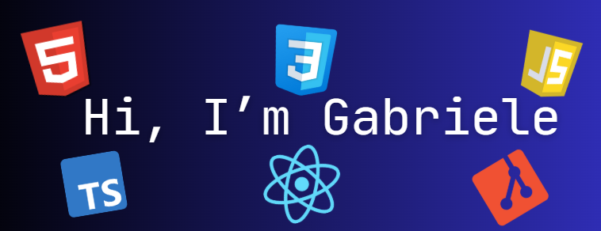

I'm a 21-year-old self-taught Junior Front-End Developer who enjoys building clean and modern user interfaces.   
I primarily work with React, TypeScript, and TailwindCSS and I have a foundational understanding of Angular and Sass.

<h2>My Stack</h2>

 

## GitHub Stats & Top Languages

## GitHub Trophies

<!--
**GabrielePre11/GabrielePre11** is a ✨ _special_ ✨ repository because its `README.md` (this file) appears on your GitHub profile.
-->
